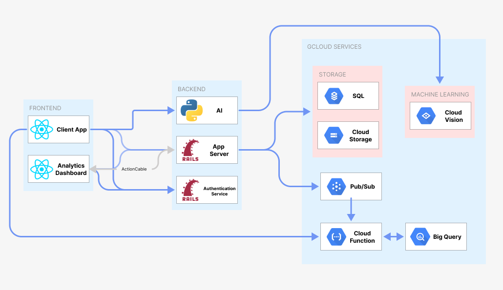

[](https://classroom.github.com/online_ide?assignment_repo_id=7980186&assignment_repo_type=AssignmentRepo)

# Service Design Studio Team 10 (Summer 2022)

## Team Members
- [Joel Tay](https://github.com/Vemrthiss)
- [Tan Kay Wee](https://github.com/kayweeee)
- [Tan Li Hui](https://github.com/t-lihui)
- [Umang Gupta](https://github.com/Usgupta)
- [Chua Po Siang Bridget](https://github.com/bridget5615)
- [Tan Kang Min](https://github.com/hamster-with-human-hands)

## Useful Links
[Design Workbook](https://docs.google.com/document/d/1-uKXlpOP6CLVI-5EansNwRvN6a_DlLZMg08y4F2JBaM/edit?usp=sharing)

[Google Site](https://sites.google.com/view/group10dynostic/home)

## App Architecture


## Client/Frontend Applications
There are two client applications for this project:
1. `client`: Inspector mobile application
2. `dashboard`: Manager web dashboard

Please visit their respective READMEs for more information
1. `client` app [README](client/README.md)
2. `dashboard` [README](dashboard/README.md)

## Backend Microservices
1. [AI inspection service](AI/)
2. [Main App Server](server/)
3. [User Authentication Service](auth_service/)

## Testing
Our application has been tested sufficiently with both unit and end-to-end testing, with a slightly heavier emphasis on E2E tests with Cucumber.

### Unit Testing
Unit testing was done with RSpec for ruby in our main app server microservice. The specs can be viewed [here](server/spec)

### E2E Testing
Since we have two 2 client/frontend applications, there are Cucumber feature/spec files for each of them.
1. The inspector mobile app feature files can be found [here](client/cypress/e2e/)
2. The dashboard web app feature files can be found [here](dashboard/cypress/e2e/)

More information can be found in each of the respective directories (i.e. `client` and `dashboard`)

## Collaborating
Clone the repository using `git clone`:
```
git clone https://github.com/Service-Design-Studio/final-project-dynos-team10.git
```
### Working on a new feature

When working on a new feature, create a **new branch** first with the following format `<name>-<featurename>` and commands:
```
# Get updated main branch
git checkout main
git pull origin main

# Create new branch
git checkout -b <name>-<featurename>

# Example
git checkout main
git pull origin main
git checkout -b john-test
```

### Commiting and Pushing your changes

Stage your changes:
```
git add .
```

Commit your changes:
```
git commit -m "INSERT COMMIT MESSAGE HERE"

# Example
git commit -m "Implemented the entire app"
```

Push to your branch using `git push` command:
```
git push origin <name>-<featurename>

# Example
git push origin john-test
```

Submit a Pull Request (PR) to the `main` branch using the GitHub website
```
Repo main page > Pull requests > New pull request
```
The `base` branch should be `main` and the `compare` branch should be your branch.
